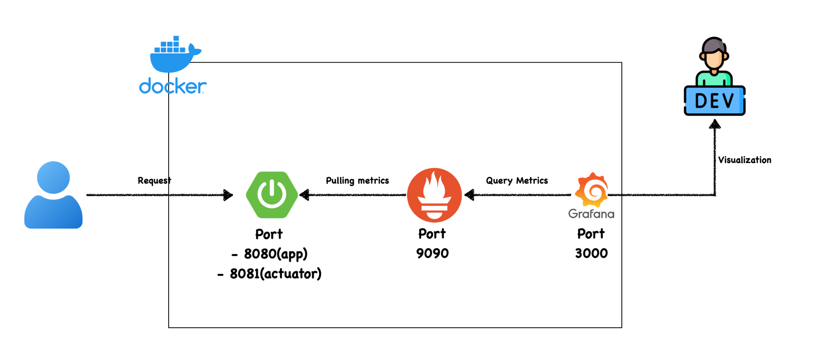
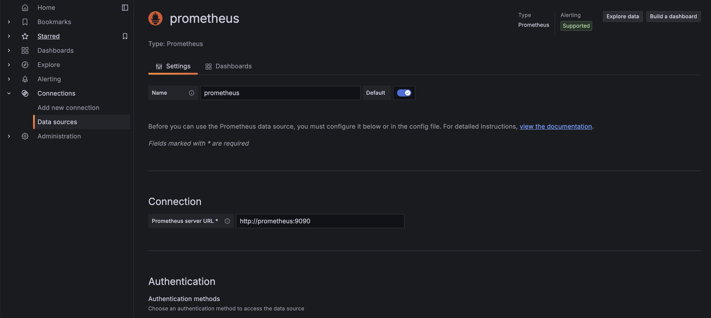

# spring-boot-observability

## 프로젝트 설명

스프링 부트 관측가능성 환경을 구성하는 프로젝트입니다.

### V1

스프링 부트 애플리케이션과 Prometheus, Grafana를 이용하여 관측가능성 환경을 구성합니다. 사용된 기술은 아래와 같습니다.

- Spring Boot 3.4
- Spring Boot Actuator
- Prometheus
- Grafana
- Docker, Docker Compose

스프링 부트 액츄에이터에서 제공하는 Prometheus로 메트릭을 수집하고 Grafana로 기본적인 대시보드를 구성합니다.

---

### 구조도



### 실행 방법

- 소스 코드를 다운 받으신 후에 프로젝트 루트 디렉토리에서 아래의 명령어를 실행합니다.

```shell
docker-compose up
```

- 이후 docker-compose.yml 파일에 정의된 서비스들이 실행됩니다.
- Prometheus는 `http://localhost:9090`으로 접속할 수 있습니다.
- Grafana는 `http://localhost:3000`으로 접속할 수 있습니다. (ID/PW: admin/admin123)
- 스프링 부트 애플리케이션은 `http://localhost:8080`으로 접속할 수 있습니다.
- Grafana에 Prometheus를 데이터 소스로 추가하고 `Spring Boot Dashboard`를 이용하여 대시보드를 확인할 수 있습니다.
    - 
- 이후 `/api/cpu`로 요청을 보내면 CPU 사용량이 증가하고 `/api/jvm-memory`로 요청을 보내면 힙 메모리 사용량이 증가합니다.
- `/api/jdbc`로 요청을 보내면 데이터베이스 커넥션 풀 사용량이 증가하는 것을 볼 수 있습니다.
- 그라파나 대시보드는 https://grafana.com/grafana/dashboards/19004-spring-boot-statistics/ 를 참고하였습니다.
    - 사이트에 접속 후 오른쪽에 보이는 `Copy ID to Clipboard` 버튼을 클릭하면 대시보드를 추가할 수 있습니다.
    - https://ttl-blog.tistory.com/1368 공유 대시보드 적용 방법